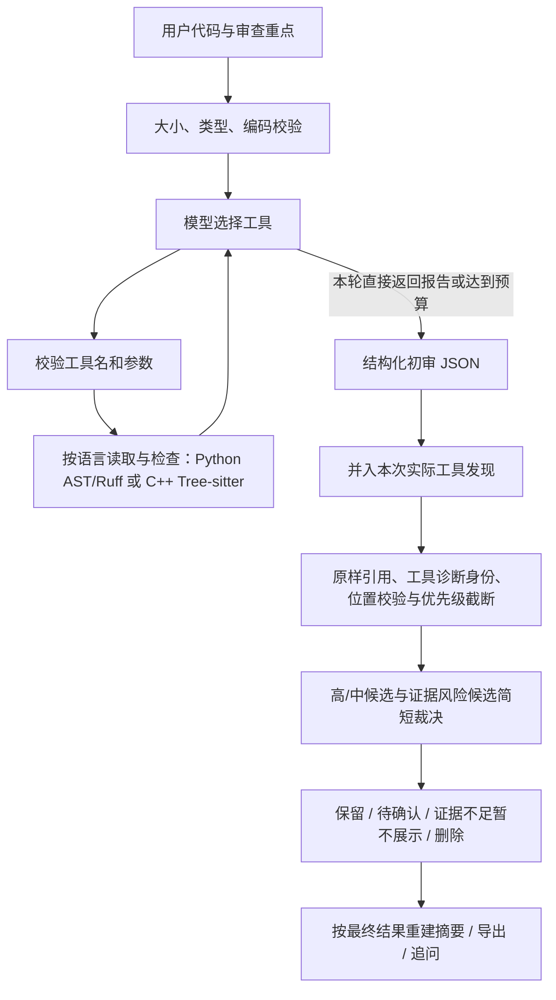
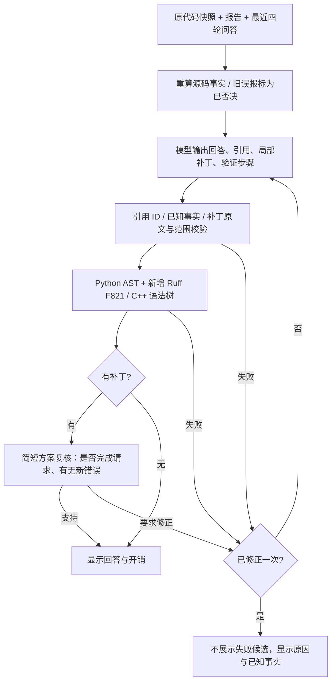

# CodeLens 设计说明

## 目标与范围

实现一个易读、可演示的代码审查 Agent，满足 Homework 1 的输入、推理、工具调用、输出循环。支持 Python 和 C++ 单文件审查。核心目标是提供可定位、有触发条件和证据的候选问题。

采用 Python + Streamlit + HTTPX + Pydantic + Ruff + Tree-sitter C++。没有引入大型 Agent 框架，工具循环直接展示在 `review_agent/agent.py` 中，方便解释协议和控制逻辑。

## 工作流

工具调用使用模型真实返回的 `tool_calls`。程序按调用 ID 将执行结果写回 `role=tool` 的消息，再交给模型决定下一步。工具和 Draft JSON 输出同时可用；模型在反馈轮直接返回报告时，程序立即解析，省掉独立的结束判断/初审请求。典型路径为工具规划 → 工具反馈与初审 → 复核，共 3 次调用。必要的追加取证、格式修复和 HTTP 重试仍会增加开销，3 次不是硬上限。

每次请求仅有一份 `numbered_source` 全量源码，不再同时发送无行号版本或在工具消息重复整份代码。`read_source` 的模型反馈改为原行号引用；静态检查结果仅返回规则、位置及简短说明。初审候选和复核仍携带定位所需的短证据片段。

“初审”和“复核”由同一模型通过不同提示词完成。复核可能改进或降低结果质量，因此需要在同一组标注样例上对比，不能预先宣称它一定更准确。

## 模块职责

| 模块 | 输入 | 输出 / 职责 |
|---|---|---|
| Web / CLI | 代码、目标、配置 | 调用共享 Agent，展示结果 |
| Agent | ReviewInput、ChatModel | ReviewReport；控制循环与预算 |
| DeepSeekClient | 消息、工具 schema | assistant 消息；记录调用与 token |
| ToolRegistry | allowlist 工具名、JSON 参数 | 工具事实结果与检查状态 |
| Draft / Finding | 模型 JSON | 严格数据结构 |
| verification | 候选、代码快照、实际工具结果 | 原样引用定位、工具来源校验、隔离不可靠候选 |
| selection | 全部本地诊断、数量上限 | 按严重性确定性排序、精确诊断去重、保留/省略数量与提示 |
| claim_checks | 候选文本、引用角色、触发来源 | 检测双端引用、空集机制与未经核实的正文工具背书 |
| AuditBatch / AuditDecision | 简短复核 JSON | 校验本轮候选 ID 全覆盖、唯一性；只返回裁决及必要修正 |
| semantics | 源码、整数形状参数 | 受限计算、带适用范围的源码事实、API 合同冲突检查 |
| followup | 代码快照、报告、近四轮历史、问题 | 结构化回答/补丁、本地校验、简短方案复核、一次修正 |
| reporting | 报告、代码快照 | Markdown |

## 工具

1. `read_source(start_line=1, end_line=null)`：读取内存中的提交快照。模型反馈仅引用请求中已有的源码行号，避免复制源码；没有路径参数。
2. `parse_structure()`：Python 使用 `ast.parse`；C++ 使用 Tree-sitter，提取函数、类、命名空间与 include 文本。两者均不执行代码，C++ 不访问 include 目标。
3. `run_static_checks()`：Python 运行内置 AST 规则与 Ruff。Ruff 通过固定参数调用，以标准输入接收代码，禁用仓库配置和缓存，设定 12 秒超时。C++ 使用独立语法树规则，不调用 Ruff 或编译器。
4. `calculate_slice(shape, slices)`：用 `slice.indices` 与 `len(range)` 计算基本切片形状，支持负索引、负步长和越界裁剪；不分配数组。
5. `check_broadcast(target_shape, source_shape)`：核对 NumPy 基本赋值广播规则；不执行被审查代码。
6. `keras_split(samples, validation_split)`：计算 Keras 尾部验证划分的左右半开索引区间，附官方合同出处。
7. `check_semantics()`：引用请求中已提取的源码事实，避免重复发送事实正文。

计算参数只允许有限整数、有限比例和至多 4 个轴，不接受表达式、路径或任意 Python。模型自由选择的计算参数仅作为 `calculations` 记录，不能自动证明其对应源码。复核会收到实际计算记录。

审查开始时，本地 AST 分析自动提取窄模式 `semantic_facts`：连续的中心 ROI 坐标公式，以及有导入和同一语句块构造依据的 Keras Model.fit。模型对象重绑定、导入遮蔽、未知参数包或不支持的公式不猜测。ROI 事实只适用于正尺寸 NumPy 基本切片，允许区域偏离中心，不能据此宣称所有图像处理正确。Keras 合同只说明末尾留出样本、不参加该次训练；不证明数据没有重复或预处理没有泄漏。

`ReviewInput.language` 从文件名后缀派生，网页、CLI、模型取证、初审、反思、追问和导出共享这一语言标识。报告记录 `language`，Markdown 和网页按语言高亮。修改文件名或语言也会使旧报告的追问失效。

C++ 解析使用 0.5 秒原生超时预算，不进行预处理、类型检查或符号链接。Tree-sitter 版本限制为 0.25.x，保留该版本的原生超时接口，避免已在本机复现的 Windows 进度回调崩溃。仅识别保守的局部模式，规则忽略注释和字符串内容。内存配对仅比较相邻声明与删除语句，遇到赋值、调用或其他流程时不猜测。语法诊断明确说明可能受宏与上下文影响，不直接宣称文件无法编译。

read_source 和 check_semantics 仍保留本地兼容入口，但不再提供给在线模型，因为请求已包含完整带行号源码和事实。已完成的无参结构/静态工具也不再重复提供；计算工具允许针对不同参数追加取证。重复静态检查会复用同次审查的结果。工具参数先用 Pydantic 校验，未知工具或非法参数作为错误反馈给模型，不转换成 shell 命令。

## 报告结构

每个问题包含 `title`、`severity`、`category`、`line_start`、`line_end`、`explanation`、`evidence`、`suggestion` 和可选 `rule_id`。

报告版本为 `schema_version=5`。新增 `evidence_role`、最多四段 `related_evidence` 和 `trigger/trigger_basis`，区分训练端、推理端、过滤条件、使用点以及外部触发假设。新增字段都有兼容默认值。

`findings` 仅包含实际静态工具发现或通过证据校验且受模型复核支持的意见；`pending_findings` 保存外部假设、未复核或复核失败的候选。特定证据约束仍未满足时，候选不进入这两个列表，只留下 `withheld` 记录；它表示证据不足，不等于 `rejected` 的机制被否决。每项附有程序赋值的 `verification`、`review_note`；保留旧版可选验证字段以兼容旧报告。`verification_records` 记录位置修正、移除不匹配规则、暂不展示、删除、待确认和保留决定。`semantic_facts` 保存源码绑定事实，`calculations` 保存模型选择参数的工具计算；两者不能混为证据强度相同的证明。

报告额外记录语言、模式、模型、审查策略、源码哈希、工具状态、复核状态、限制、执行事件和耗时。`metrics.stages` 逐次记录模型、工具、本地校验耗时和 token 增量，失败重试的时间包含在对应调用阶段内。API Key 不在报告数据结构中。

证据校验规则：

- 模型 `evidence` 必须是连续的原样源码片段，不做改变字符串语义的空格压缩或模糊匹配。
- 注释和 Python 独立文档字符串不能作为运行故障的代码证据。C++ 位置按 UTF-8 字节与字符偏移正确转换。
- 优先匹配所报范围；范围错误时只有全文件唯一匹配才自动改正行号。无法唯一定位的候选进入待确认；越界且无法恢复的候选删除。
- `rule_id` 必须匹配本次实际工具诊断。起始行错误但已定位的连续原样引用包含工具锚及工具证据时，可唯一恢复到真实工具位置。同一规则和行号有多个诊断时，进一步比对证据、标题和解释，不猜测归属。匹配后恢复工具原始内容，否则移除工具背书。非实际工具候选的标题、正文、建议、trigger、复核 reason 中也不能保留规则编号/工具命中说法，未修正则暂不展示。解析诊断可以保留真实工具诊断文本，不要求该文本出现在源码中。
- 模型复核接收通过主引用定位的高/中候选，以及触发证据约束的低优先级候选，放入同一个请求。逐个返回 verdict、basis、impact_kind 和简短 reason；仅确需修正时填写 correction/suggestion/title/补充引用/触发来源。初审输出预算 3200 token；复核基础预算 1600 token，随实际候选数按每项 160 token 增长，代码上限 6000（当前 30 条候选最多 4800）。复核不允许新增候选或修改主引用；补充引用会重新定位。缺少/重复/新增 ID 会触发一次修复，再失败则隔离模型意见。
- 低优先级真实工具发现保留为静态规则命中；普通低优先级模型意见留在待确认。空集、预处理比较、工具背书缺口即使是 low 也需复核。未新增独立审查阶段，但原本完全跳过复核的请求可能增加一次调用。
- 筛选为空需要具体输入/路径、触发来源以及 condition/consumer 两处引用，数据加载失败与筛选为空不能混成一个机制。允许将混合意见收窄为原候选中有依据的一项；uncertain 裁决也会应用修正，避免旧正文与新 reason 相互矛盾。外部环境假设不升级为正式意见。
- 预处理比较需要 training/inference 两端独立且不重叠的原样引用。涉及未知输入极性或精度影响的断言必须收窄为源码可见操作；网页、导出、追问共享补充证据。校验只覆盖有限的自然语言表达，不能证明所有训练/推理路径语义等价。
- 语义事实检查在复核前后均执行。已识别中心切片上的空数组断言，以及把 Keras 尾部留出说成随机划分/仅凭同源认定泄漏的说法，被删除并记录否决原因；模型给出 supported 也无法绕过。匹配是保守的启发式，无法覆盖所有等价写法或所有第三方 API。
- 依赖外部假设的候选即使模型标为 supported 也进入待确认；复核只能降低原候选优先级。页面与 Markdown 合并展示问题和待确认意见，每条保留依据状态；页面优先级数量包含所有展示条目，不表示已确认缺陷数。底层 JSON 仍区分 findings/pending_findings，追问上下文附统一列表编号，避免合并后指错项目。
- `impact_kind` 区分运行故障、错误结果、资源/安全、维护性、诊断提示和风格。仅诊断体验改善强制为低优先级待确认；风格偏好强制删除；维护性意见最高为低优先级。
- 最终摘要由保留项和待确认项重建，防止已删除的问题残留在模型初审摘要中。

这些检查证明引用对应及流程约束，不证明语义正确。静态规则也有适用条件，同模型复核仍可能重复错误，必须结合人工评估。

## 工具发现补回与容量限制

模型初审不是本地工具诊断的唯一出口。只要本次实际执行过 `run_static_checks`，程序就将返回的 AST/Ruff/C++ 诊断与模型候选合并，再进行定位、精确去重、排序和复核。模型输出空列表不会抹去工具发现；没有调用或调用失败的工具不会产生虚构结果。direct 基线仍不调用工具。`verification_records` 以 `recovered` 标记由程序补回的实际工具候选，以 `truncated` 标记超过报告容量的候选。

补回发生在复核前。复核可以基于上下文明确否决工具候选，程序不会在报告末尾将它重新添加。低优先级规则或复核失败时保留的规则，仍只标作“静态规则命中”，不冒称测试通过。

容量限制分两层：工具每个诊断通道最多保留 40 条（Python AST 和 Ruff 各 40，C++ 本地规则 40；C++ 语法诊断 5），完整遍历后按高→中→低排序再截断。工具返回原始总数、去重后数量、保留数、省略数与提示；同一行不同未定义变量或不同表达式仍是不同诊断。之后模型与工具候选合并、去重后最多 30 条进入报告处理；同优先级先保留真实工具诊断。每条因报告预算省略的候选有 `truncated` 记录，限制和事件中显示准确数量。不能把工具阶段的省略数与报告阶段的省略数混为同一总数。

排序不改变候选 ID，复核必须覆盖实际入选且需复核的 ID 集合。精确诊断去重和唯一原样引用恢复不等于一般自然语言语义去重；没有明确规则对应的模型改写仍可能重复，需继续评估。

前端展示的代码片段始终来自输入快照，避免把模型生成片段误当作原代码。执行记录仅包含阶段与工具状态，不展示模型私有推理内容。

## 错误与终止

| 情况 | 行为 |
|---|---|
| 空输入、超过大小或行数、无效编码 | 调用模型前拒绝，给出可操作提示 |
| 语法错误 | 形成位置明确的解析诊断，说明检查可能不完整 |
| 未知工具、错误参数 | 返回错误供模型纠正，受同一预算限制 |
| Ruff 缺失、超时 | 记录失败状态和覆盖限制，不视为零问题 |
| API 429、部分服务错误、网络错误 | 最多三次尝试，指数退避 |
| API 400、401、402 等 | 直接返回可读提示，不暴露响应体或密钥 |
| 模型输出截断 | 报错，建议缩小输入范围 |
| JSON/schema 无效 | 最多再请求一次修复，然后报错 |
| 模型复核失败 | 标注 `failed`；保留真实静态工具发现；证据约束仍不满足的候选暂不展示，其余候选移入待确认 |
| 工具四轮或八次上限 | 结束取证，基于已有结果输出并标注覆盖限制 |

## 记忆和状态

一次审查过程中维护工具消息。后续追问使用原代码、报告和最近四轮问答，不携带全部工具原始消息。新审查清空旧追问；编辑区发生变化时明确标注旧报告，禁用追问直至重新审查。

离线模式的调度次序固定为读取 → 结构 → 静态检查，其目的在于演示真实工具与页面集成。`local_only` 复核核对工具来源、位置和重复项，不冒充模型反思。演示模式中模型调用和 token 均为 0。

## 追问与建议代码

历史作为数据放入上下文，不能覆盖源码事实。旧报告中的 ROI 空数组误报会在追问上下文被重新判定；解释须区分当前快照与应用建议之后的假设行为。明确的 160×120 ROI 是否为空、已识别 Keras validation_split 合同问题优先使用本地事实直答（零模型调用）；其他解释类追问通常一次模型调用；代码建议通常“生成 + 方案复核”两次，最多两份候选和两次方案复核（四次调用），底层 HTTP 重试另计。复核输出上限 800 token。

v5 的追问上下文还会重新检查旧意见的空集条件、双端证据和正文工具归属，把不足项单列为 `withheld_claims`，与 `rejected_claims` 分开，不修改已保存报告。页面中的旧版本报告要求重新审查，才能获得新版主审结果。

补丁包含原快照行号、原文和替换内容，最多三段。检查范围、完整行原文匹配及互不重叠；在内存组合后检查语法与新增未定义名称。C++ 不编译；Python 不导入提交模块。要求优化时不能只返回方向，必须提供可定位改写，除非用户明确只要解释。没有自动保存/应用补丁或运行任意代码的入口。

事实检查是有适用条件的规则：检查已识别 ROI 算例的空数组与显式错误形状描述，以及已识别 Keras 划分合同。对明确的统一预处理请求，还可沿命名为 train 与 camera/infer/predict 的局部函数及 helper 比较部分 OpenCV 阈值/形态学/滤波操作；入口不明确、动态调用等情况不作等价性推断。它不验证所有数学推理、所有 API 或每一句自然语言，也不证明两条图像处理链完全等价。同一模型的方案复核也可能漏掉错误，不能把“校验完成”解释为“正确性已证明”。识别率只提供实验设计，未训练或测试识别模型，不能承诺提升。失败内容不展示，但评估脚本可保存合成样例的原始候选以便开发复查。

## 与评分要求的关系

- 功能完整性 40%：输入、报告、交互、导出及主要错误处理。
- Agent 架构 30%：工具反馈循环、反思阶段、上下文记忆、预算。
- 代码质量 20%：模块边界、统一 schema、固定工具入口、自动化测试。
- 文档 10%：README、设计说明、评估方案与样例。

后续扩展可优先考虑 Git diff 和多文件上下文，再评估是否需要自动修复或隔离执行测试。
